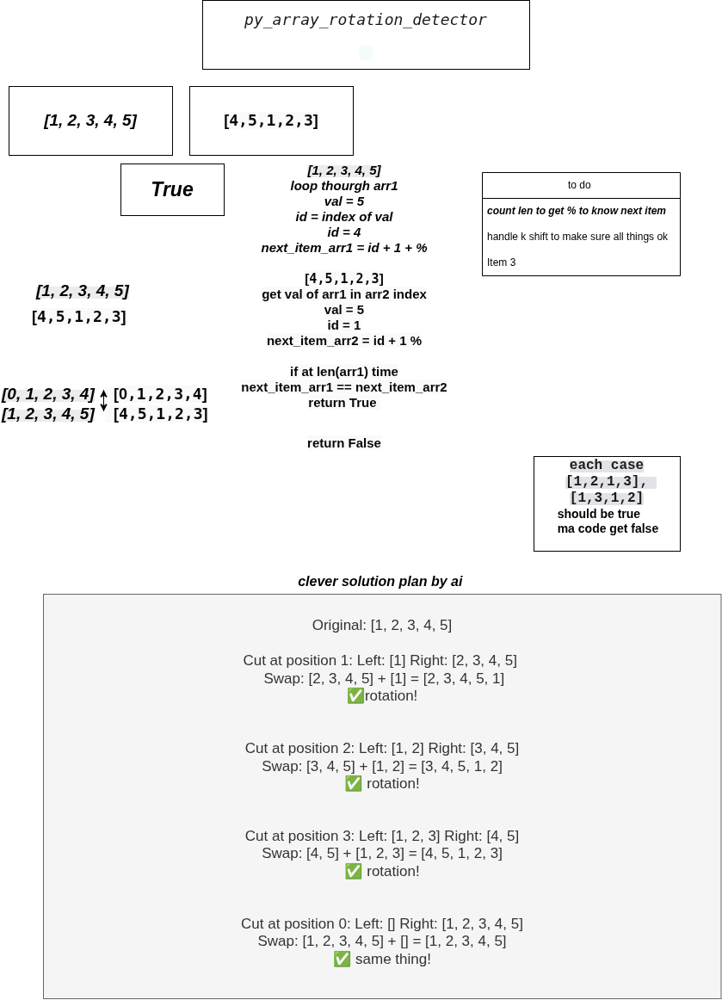

# Exam-rank-04


 ---

### py_array_rotation_detector

> py_array_rotation_detector.py


## My Flowchart



#### Moulinette Rules & Constraints

> Forbidden built-ins / modules: collections.deque.rotate(). Use only permitted built-in functions to avoid getting 0 on exam day.

#### Assignment
Write a Python function that takes two lists (arrays) as parameters and determines if the second list is a rotation of the first list (left or right).

A rotation means that the elements are shifted circularly. For example, shifting [1, 2, 3] to the right by one position results in [3, 1, 2].

The function must return True if arr2 is a rotation of arr1, and False otherwise.
If the arrays have different lengths, they cannot be rotations of each other.
Two empty arrays are considered rotations of each other.

#### Function signature

> def array_rotation_detector(arr1: list, arr2: list) -> bool:
```
Examples

Input
array_rotation_detector([1, 2, 3, 4, 5], [4, 5, 1, 2, 3])
Output
True

Input
array_rotation_detector([1, 2, 3, 4, 5], [5, 1, 2, 3, 4])
Output
True

Input
array_rotation_detector([1, 2, 3], [3, 2, 1])
Output
False

Input
array_rotation_detector([1, 2], [1, 2, 3])
Output
False

Input
array_rotation_detector([], [])
Output
True
```

---